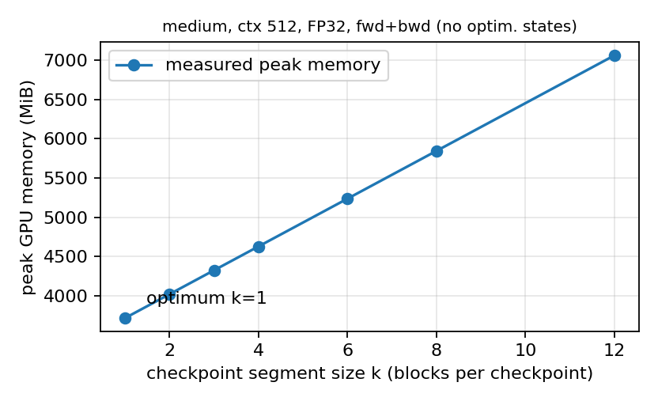
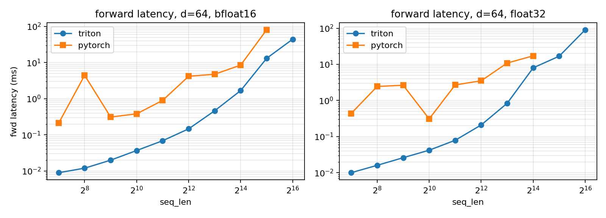
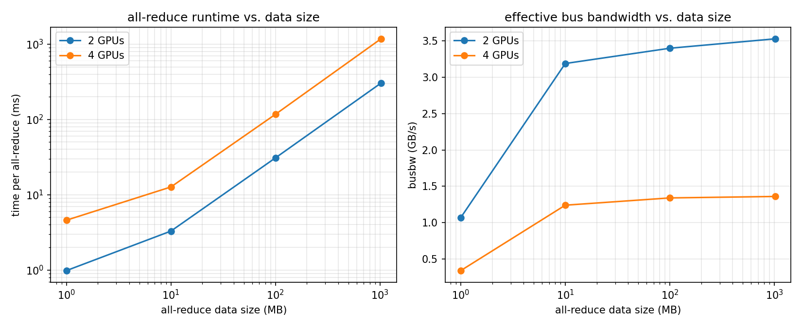
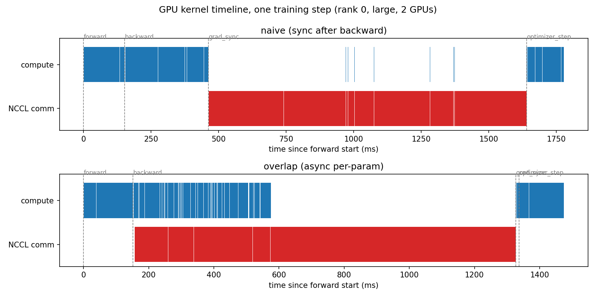
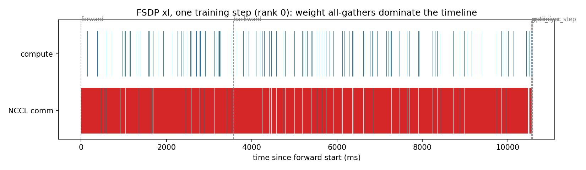

# 2.1.3 End-to-End Benchmarking (benchmarking_script)

## (a) The script

`cs336_systems/benchmarking_script.py` initializes a basics Transformer from `--model_size`,
generates a random batch, and times forward-only / forward+backward / full training steps
(`--mode`), with `--warmup_steps` (default 5) before `--measurement_steps` (default 10) timed
steps, calling `torch.cuda.synchronize()` around each timed phase (CUDA calls are asynchronous, so
unsynchronized wall time would not measure GPU work).

## (b) Timings by model size

Full training step, batch 4, ctx 512, FP32, 5 warm-up + 10 measured steps (data:
`benchmark_results_20260731_224137.txt`):

| size | forward (ms) | backward (ms) | optimizer step (ms) |
|---|---|---|---|
| small  | 24.86 ± 0.02  | 56.81 ± 0.19  | 11.06 ± 1.96 |
| medium | 83.87 ± 0.07  | 166.37 ± 0.29 | 32.51 ± 0.49 |
| large  | 169.27 ± 0.49 | 340.40 ± 0.83 | 89.67 ± 0.65 |

The backward pass takes ≈2× the forward, matching its ≈2× FLOP count (grad-input plus grad-weight
matmuls), and measurement variability is tiny (well under 1% for forward/backward). xl and 10B are
absent because a full FP32 training step does not fit on 24 GiB (xl needs ≥25.4 GiB for
parameters+gradients alone — see 2.1.6).

## (c) Effect of skipping warm-up

Repeating the small-model measurement with 0 / 1 / 2 warm-up steps: without warm-up the mean
forward time jumps from ≈47.7 ms to 81.7 ms with the standard deviation exploding from <1 ms to
107 ms — the first step pays one-time costs (CUDA context creation, allocator pool growth,
cuBLAS/kernel autotuning) and dominates the average. One or two warm-up steps already suffice to
stabilize the small model, but larger models and NCCL communication need more (allocator and
library caches grow per shape encountered), which is why we keep 5. (Absolute times here are from a
different GPU/day than (b); only the relative comparison matters.)

# 2.1.4 Nsight Systems Profiling (nsys_profile)

## Setup

- Hardware: 1× NVIDIA GeForce RTX 3090 (24 GiB), driver 580.95.05, PyTorch 2.11.0+cu130, Nsight Systems 2026.1.3.
- Script: `cs336_systems/benchmarking_script.py` (extended with `--context_length`, `--batch_size`, `--annotate`
  and NVTX ranges `measure` / `forward` / `backward` / `optimizer_step`; `--annotate` swaps in an
  NVTX-annotated `scaled_dot_product_attention` with sub-ranges `computing attention scores`,
  `computing softmax`, `final matmul`). In `forward-only` mode the pass runs under
  `torch.inference_mode()` (true inference benchmarking; also avoids retaining the autograd graph).
- Batch size 4, FP32, 5 warmup + 10 measurement steps per profile. Profiles were collected with
  `nsys profile --trace=cuda,nvtx -o profiles/<name> python cs336_systems/benchmarking_script.py ...`
  and analyzed with `nsys stats` (`nvtx_gpu_proj_sum`, `nvtx_kern_sum`, `cuda_gpu_kern_sum`),
  filtering kernels by NVTX range so warmup steps are excluded from the per-phase numbers.

Profiled combinations (two model sizes, three power-of-two context lengths > 128):

| profile | model | ctx | mode | timeit fwd (ms) |
|---|---|---|---|---|
| small_ctx256_fwd  | small (d=768, L=12) | 256  | forward-only | 30.5 |
| small_ctx1024_fwd | small | 1024 | forward-only | 114.7 |
| small_ctx4096_fwd | small | 4096 | forward-only | 977.4 |
| large_ctx512_fwd  | large (d=1280, L=36) | 512  | forward-only | 299.0 |
| large_ctx2048_fwd | large | 2048 | forward-only | 1856.2 |
| small_ctx1024_fwd_bwd | small | 1024 | forward+backward | fwd 113.9 / bwd 239.5 |
| small_ctx1024_train   | small | 1024 | full training step | fwd 112.7 / bwd 240.4 / opt 31.5 |
| small_ctx1024_fwd_ann | small | 1024 | forward-only, annotated attention | 114.6 |

Note on "longest context that fits in memory": `large` at ctx 4096 OOMs on 24 GiB even in inference
mode (the FP32 attention-score temporaries alone are ~5 GiB each at that length), so ctx 2048 is the
longest length profiled for `large`; `small` fits ctx 4096.

## (a) Total forward-pass time; does it match the timeit measurements?

The GPU time attributed to the `forward` NVTX range (sum of kernel time projected onto the range,
per step) matches the `timeit` wall-clock measurements to within ~1% on every profile:

| profile | nsys GPU fwd/step | timeit fwd/step |
|---|---|---|
| small/256  | 30.06 ms  | 30.52 ms |
| small/1024 | 114.53 ms | 114.75 ms |
| small/4096 | 977.10 ms | 977.44 ms |
| large/512  | 298.84 ms | 299.01 ms |
| large/2048 | 1855.94 ms | 1856.24 ms |

They agree almost exactly, which is expected: the script synchronizes the CPU with the GPU around
each phase, so wall-clock time equals GPU kernel time.

## (b) Top CUDA kernel in the forward pass; same kernel for fwd+bwd?

During the forward pass the kernel with the most cumulative GPU time is `ampere_sgemm_128x64_tn`
(an FP32 GEMM); for small/1024 it is invoked 73 times per forward pass (once per linear/matmul
instance across the 12 layers, the rest of the 109 matmul calls landing on other `sgemm` tilings)
and accounts for ~38 ms of the ~114 ms forward. When profiling forward+backward together, the top
kernel overall is still an SGEMM but a different tiling — `ampere_sgemm_128x64_nn` (669 ms vs. the
tn variant's 562 ms over the run) — because the backward pass adds NN-layout gradient GEMMs; i.e.,
matmuls dominate in both cases, with backward adding ~2× more GEMM time than forward alone.

## (c) Non-matmul kernels with non-trivial runtime in the forward pass

Several elementwise/reduction kernels each take ~4–6.5 ms per forward (small/1024, ~45% of forward
GPU time collectively): `exp_kernel_cuda` (softmax), `reduce_kernel` (softmax max/sum reductions),
`MulFunctor` elementwise kernels (RoPE rotation, 1/√d scaling, causal masking via `where`),
`CUDAFunctor_add` (residual adds / bias), and `sigmoid`+`mul` (SwiGLU gating). Their share grows
quickly with context length — at small/4096 the GEMM share of forward drops from 68.7% (ctx 256) to
37.9%, because the O(S²) attention-score temporaries make these memory-bound elementwise passes as
expensive as the GEMMs.

## (d) Full training step vs. inference: how does the matmul fraction change?

For small/1024 a full step takes ~385 ms GPU time (forward 112.5, backward ~240, AdamW ~31).
Matmuls drop from 54.7% of kernel time in the forward-only profile to 48.5% over the full training
step, while elementwise kernels grow correspondingly: backward contributes large pointwise kernels
(gradient elementwise ops, ~500 ms and ~286 ms over the run) and AdamW is pure elementwise work
(10,125 invocations of its update kernels, 0% GEMM). Absolute GEMM time per step rises from ~62 ms
(forward only) to ~179 ms (fwd+bwd), but the step is ~3.4× longer, so the matmul fraction falls.

## (e) Softmax vs. matmul runtime inside self-attention (forward, small/1024)

From the annotated profile, per forward step (12 layers): the softmax NVTX range accounts for
~24.3 ms GPU time, while the two attention matmuls — QKᵀ (`computing attention scores` GEMM, ~4.8 ms)
and P·V (`final matmul` GEMM, ~7.6 ms) — total only ~12.4 ms. So softmax is ~2× slower than both
attention matmuls combined despite doing ~50× fewer FLOPs (≈0.25 GFLOP of exp/max/sum/divide vs.
≈12.9 GFLOP for the two 2·B·H·S²·d_k matmuls): softmax is memory-bandwidth-bound, streaming the
192 MiB FP32 score tensor through ~5 elementwise/reduction passes per layer, while the GEMMs are
compute-bound and run near SGEMM peak. (The masking/scaling elementwise ops in the scores range
cost another ~13 ms/step, more than the QKᵀ GEMM itself.)

## Reproduce

```sh
nsys profile --trace=cuda,nvtx --force-overwrite=true -o profiles/small_ctx1024_train \
  python cs336_systems/benchmarking_script.py \
    --model_size small --context_length 1024 --mode full-training-steps
nsys stats --report nvtx_gpu_proj_sum --report nvtx_kern_sum --report cuda_gpu_kern_sum \
  --format csv -o profiles/small_ctx1024_train profiles/small_ctx1024_train.nsys-rep
```

Raw artifacts: `profiles/*.nsys-rep`, parsed summaries: `profiles/*_nvtx_*.csv`,
`profiles/*_cuda_gpu_kern_sum.csv`.


# 2.1.5 Mixed Precision

## mixed_precision_accumulation

Accumulating 0.01 a thousand times in FP32 gives 10.0001, while accumulating in FP16 gives 9.9531 — an error about 500× larger, because every addition rounds to the FP16 accumulator's precision (whose ulp near 10 is ≈0.008, the same order as the 0.01 increment itself). Cases 3 and 4 both give exactly 10.0021, showing that `s += fp16_tensor` already promotes the addend to FP32, so the explicit cast changes nothing; their residual error (+0.0021) comes entirely from 0.01 not being representable in FP16 (it rounds to 0.010002136), not from the accumulation. The takeaway is that the precision of the *accumulator* matters far more than that of the values being accumulated, which is why mixed-precision training keeps accumulations and reductions (loss sums, softmax denominators, LayerNorm statistics, optimizer moments) in FP32 even when activations and gradients are downcast.

## benchmarking_mixed_precision

### (a) Data types under FP16 autocasting

Verified empirically on GPU with `cs336_systems/check_autocast_dtypes.py`:

| component | dtype | why |
|---|---|---|
| model parameters | FP32 | autocast never casts the stored parameters; it casts inputs on the fly inside each op |
| output of `fc1` | FP16 | matmul/linear are on the autocast-to-FP16 list |
| output of `ln` (LayerNorm) | FP32 | `layer_norm` is on the autocast FP32 list |
| predicted logits (`fc2` out) | FP16 | the FP32 LayerNorm output is cast back to FP16 at the matmul boundary |
| loss (`cross_entropy`) | FP32 | losses are on the autocast FP32 list |
| gradients | FP32 | gradients are produced in the dtype of the parameters |

### (b) Why LayerNorm is treated differently; does BF16 change this?

LayerNorm's mean and variance are reductions over the feature dimension — exactly the kind of accumulation that low-precision accumulators wreck (per the accumulation exercise above): in FP16 the sums lose precision quickly, and squaring activations can overflow FP16's narrow ±65504 range. With BF16 the range problem disappears (BF16 has FP32's 8-bit exponent), but its mantissa is only 8 bits — worse than FP16's 10 — so the accumulation error in the statistics is, if anything, larger; LayerNorm therefore still needs to run in FP32 under BF16. This matches observed behavior: under `torch.autocast(dtype=torch.bfloat16)`, `layer_norm` still outputs FP32.

### (c) BF16 mixed-precision timings

The benchmarking script was extended with a `--mixed_precision` flag that wraps the forward pass in
`torch.autocast(device_type="cuda", dtype=torch.bfloat16)` (a `nullcontext` is used when disabled);
backward needs no autocast context since op dtypes are fixed by the autograd graph built in forward.
Timing below: batch 4, context 512, 5 warmup + 10 measurement steps, forward+backward mode, RTX 3090.

| size | fwd FP32 (ms) | fwd BF16 (ms) | fwd speedup | bwd FP32 (ms) | bwd BF16 (ms) | bwd speedup |
|---|---|---|---|---|---|---|
| small  | 73.7 | 56.0 | 1.32× | 148.5 | 93.7 | 1.58× |
| medium | 181.1 | 135.0 | 1.34× | 373.0 | 217.3 | 1.72× |
| large  | 372.0* | 187.4* | 1.99× | OOM | 409.8 | — |

*large FP32 forward+backward does not fit in 24 GiB (peak allocation 20.9 GiB collided with a
~2.6 GiB co-tenant process), so the large forward numbers are from forward-only runs on the same
(shared) GPU; the BF16 forward time from the forward+backward run (196.9 ms) is consistent with
the forward-only one. `xl` and `10B` cannot be benchmarked on a single 24 GiB card even in BF16,
because autocast keeps parameters and gradients in FP32 (xl alone needs 21.8 GiB for those two).

Commentary: BF16 mixed precision speeds up both passes everywhere, and the gain grows with model
size — from ~1.3× (small) to ~2.0× (large) in the forward pass, with backward gaining more than
forward (1.6–1.7×) since GEMMs make up a larger share of backward FLOPs. This matches the hardware:
on the RTX 3090, FP32 GEMMs run on CUDA cores while BF16 GEMMs run on Tensor Cores with ~2× the
peak throughput, and the BF16 elementwise kernels additionally halve memory traffic; small models
are further from the GEMM roofline (launch overhead and small, low-occupancy matmuls), so they
capture less of the Tensor Core advantage. A second, equally important benefit is memory: BF16
halves activation memory, which is what allowed the `large` forward+backward run to fit at all.

---

# 2.1.6 Profiling Memory (memory_profiling)

Setup: `--memory_profile` flag added to `benchmarking_script.py` (records allocation history for the
measurement steps only, dumps a `memory_*.pickle` snapshot for pytorch.org/memory_viz, and prints
`torch.cuda.max_memory_allocated`). All numbers below were parsed directly from the snapshot pickles
(`profiles/mem_analyze.py`, `profiles/mem_alive.py`). Hardware note: this machine has 24 GiB RTX 3090s
(shared with other tenants), while the handout's xl full training step needs ~40 GiB of static state
alone (FP32 params 10.2 + grads 10.2 + AdamW moments 20.4 GiB), so the xl training-step measurements
are physically impossible here; large/small substitutions are noted where used.

## (a) Memory timelines

Snapshots to view in pytorch.org/memory_viz: `memory_xl_ctx2048_forward-only.pickle` (inference) and
`memory_large_ctx128_full-training-steps.pickle` (training step; xl substituted by large, see note
above). The inference timeline is a flat plateau (parameters) with a repeated per-layer spike pattern
as each TransformerBlock materializes and frees its attention-score temporaries, all 10 steps
identical. The training-step timeline is a sawtooth: memory climbs through the forward pass as each
block's residuals accumulate for backward, drops sharply as backward frees them layer by layer in
reverse, and the optimizer step appears as a flat bump at the end — the three stages are clearly
distinguishable from the peaks alone.

## (b) Peak memory by context length

| context | xl forward | full training step |
|---|---|---|
| 128  | 13,128 MiB | xl: does not fit (≥39.8 GiB static state); large substitute: 17,978 MiB |
| 2048 | 22,307 MiB | xl: does not fit; small substitute: ~23.9 GiB → also OOM on 24 GiB |

Forward-pass peaks are dominated by parameters at short context (12.8 GiB ≈ the 10.2 GiB of FP32
weights) and by the O(S²) attention temporaries at long context. Full training steps add gradients +
optimizer states + per-layer residuals, pushing even `small` at ctx 2048 just past 24 GiB with this
unfused attention implementation — the motivation for activation checkpointing (section 3).

## (c) Effect of mixed precision on peak memory

Mixed precision helps only when activations are a significant fraction of peak memory: xl forward at
ctx 2048 drops from 22,307 → 19,906 MiB (−10.8%; attention temporaries halve, though softmax outputs
stay FP32 under autocast), while at ctx 128 it barely moves (13,128 → 13,119 MiB) because the peak is
almost all FP32 parameters. For a full training step (large, ctx 128) peak even rose slightly,
17,978 → 18,657 MiB, since parameters/gradients/optimizer states remain FP32 and autocast's on-the-fly
BF16 weight copies add more than the tiny short-context activation savings.

## (d) Size of one residual-stream activation tensor (xl, FP32)

Shape (batch 4, seq S, d_model 2560) at 4 bytes: S=128 → 4·128·2560·4 = 5,242,880 B = **5 MiB**;
S=2048 → 4·2048·2560·4 = 83,886,080 B = **80 MiB**.

## (e) Largest allocations in the xl forward pass

At ctx 2048 the largest individual allocations are 2,048 MiB each — exactly B·H·S·S·4 B =
4·32·2048²·4 B, i.e., the attention-score/softmax tensors — appearing once per layer (32 times per
step); the stack trace roots them at `model.py:253` (`x = layer(x)`, the capture truncates deeper
frames, but the size uniquely identifies the attention scores inside the TransformerBlock). At ctx 128
these shrink to 8 MiB and the largest allocations become the 20 MiB FFN hidden tensors
(4·128·10240·4 B).

## (f) Per-TransformerBlock residuals and gradients (large, ctx 128, FP32)

Method: a `forward-save` mode (forward with grad enabled, no backward) keeps every tensor saved for
backward alive; the alive-at-end set of its snapshot gives residuals exactly, and the alive-at-end set
of a 1-step forward+backward snapshot gives gradients. (Equivalent to the nsys `--cuda-memory-usage`
+ `--pytorch=functions-trace` GUI route, but exact per-tensor rather than visual.)

Residuals saved for backward: **85.3 MiB per block** (3,072 MiB over 36 blocks). The five largest
contributor groups per block:

| # | tensors (per block) | MiB | % | producing op |
|---|---|---|---|---|
| 1 | 5 × 10.00 | 50.0 | 58.7% | SwiGLU FFN hidden tensors (w1/w3 outputs, SiLU output, gated product; 4·128·5120·4 B each) |
| 2 | 10 × 2.50 | 25.2 | 29.5% | residual-stream-width tensors (ln1 out, Q/K/V, RoPE'd Q/K, attention concat, ln2 out, block output; 4·128·1280·4 B) |
| 3 | 2 × 5.00 | 10.0 | 11.7% | attention score matrices saved by softmax/einsum (4·20·128²·4 B) |
| 4 | 1 × 0.08 | 0.08 | 0.1% | RoPE frequency tables / masks |
| 5 | 1 × 0.04 | 0.04 | 0.05% | small misc. buffers |

Gradients produced per block: **100 MiB** (75 MiB for the three FFN matrices at 25 MiB each +
25 MiB for the four attention projections at 6.25 MiB each). This matches the expectation exactly:
one FP32 gradient per parameter, and each block holds 26.2 M parameters × 4 B = 100 MiB. During
backward each block therefore frees ~85 MiB of residuals while allocating ~100 MiB of gradients —
net active memory *rises* slightly through the backward pass, which is exactly what the training-step
timeline shows.

---

# 3.2 Activation Checkpointing

## gradient_checkpointing (a): Memory-optimal strategy with nested checkpointing

The memory-optimal strategy is recursive binary ("tree") checkpointing: split the stack of N blocks
in half, wrap each half in its own `checkpoint` call, and recurse until a segment contains a single
block, which runs normally. At any moment only the checkpoints along the current recursion path are
alive — one per level, i.e. O(log N) checkpoint tensors of size c — plus the residuals of the single
leaf block currently being recomputed, so peak activation memory is O(c·log N + M) = O(log N), down
from O(N) without checkpointing and O(√N) with a single checkpointing level. The price is compute:
each level of nesting adds one more recomputation of the segments below it, so each block is
recomputed O(log N) times and total compute rises from Θ(N) to Θ(N log N) (T(N) = 2T(N/2) + Θ(N)).
Binary splitting is optimal because, with a levels and m-way splits, peak memory ≈ a·m·N^{1/a} subject
to m^a = N, which is minimized at a small constant m and a = Θ(log N).

```python
def run_segment(blocks, x, lo, hi):
    if hi - lo == 1:
        return blocks[lo](x)            # leaf: run one block normally (residuals saved)
    mid = (lo + hi) // 2
    x = checkpoint(lambda t: run_segment(blocks, t, lo, mid), x, use_reentrant=False)
    x = checkpoint(lambda t: run_segment(blocks, t, mid, hi), x, use_reentrant=False)
    return x

y = run_segment(blocks, x, 0, N)        # peak memory O(log N), compute O(N log N)
```

## gradient_checkpointing (b): Best single-level checkpointing granularity

Setup: `cs336_systems/checkpointing_script.py` wraps every k consecutive TransformerBlocks in one
`torch.utils.checkpoint.checkpoint(..., use_reentrant=False)` segment and measures peak GPU memory
of a forward+backward step via `torch.cuda.max_memory_allocated` (batch 4, FP32; AdamW states are
skipped — they add a k-independent constant and do not affect the comparison).

Constraint note: the handout's xl @ ctx 2048 configuration cannot run forward+backward on a 24 GiB
RTX 3090 even with per-block checkpointing — parameters + gradients alone are 20.4 GiB, and adding
2.5 GiB of checkpoints plus one block's recomputed residuals (~3.65 GiB) exceeds the card (verified:
k=1 probe OOMs). The sweep was therefore run on the **medium** model (N=24 blocks), which has an
identical trade-off structure, at ctx 512 (ctx 2048 points that fit the shared card showed the same
shape; larger-k ctx-2048 runs were evicted by co-tenant memory pressure).

Measured peak memory (MiB) vs. segment size k:

| k (blocks/ckpt) | 1 | 2 | 3 | 4 | 6 | 8 | 12 | 24 (=all) | 0 (off) |
|---|---|---|---|---|---|---|---|---|---|
| peak (MiB) | 3712.7 | 4017.4 | 4322.0 | 4626.6 | 5235.9 | 5845.2 | 7063.7 | OOM | OOM |



The optimum is **k = 1 (checkpoint every block)**, and the neighbors confirm it: k=2 costs +305 MiB
and k=3 +609 MiB, while disabling checkpointing (or using one giant segment) needs ~13 GiB and OOMs
on the shared card. The measured peaks fit peak(k) = 304.6·k + 3408 MiB almost exactly — i.e. the
short-term term k·M (M ≈ 305 MiB of residuals per block) grows linearly while the long-term term
(N/k)·c (c = 8.4 MiB per checkpoint) is negligible here, so the balance point
k\* = √(cN/M) ≈ √(8.4·24/305) ≈ 0.8 rounds to k = 1. Because M ≫ c for Transformer blocks (the
block's residuals dwarf one residual-stream tensor), single-level checkpointing should always use
the finest granularity; coarser segments only pay off when checkpoint storage is comparatively
expensive. The same arithmetic for xl @ 2048 (c = 80 MiB, M ≈ 3.65 GiB) likewise gives k\* < 1 →
checkpoint every block, which needs ≈ 20.4 + 2.5 + 3.65 ≈ 26.5 GiB — feasible on the course's
40/80 GiB GPUs, just not on a 24 GiB 3090.

---

# 4.1 Benchmarking PyTorch Attention

## pytorch_attention

Setup: `cs336_systems/attention_benchmarking_script.py` benchmarks
`cs336_basics.model.scaled_dot_product_attention` (batch 8, no head dimension, FP32, 5 warmup +
100 timed iterations, `torch.cuda.synchronize()` around each pass), sweeping
d_model × seq_len. GPU: RTX 3090 24 GiB **shared with a ~13.4 GiB co-tenant** (effective capacity
~10 GiB), which lowers the measured OOM boundary (see analysis below).

Timings (ms per pass, mean of 100) and memory in use right before backward (MiB):

| d_model | seq_len | fwd (ms) | bwd (ms) | mem before bwd (MiB) |
|---|---|---|---|---|
| 16  | 256   | 0.87 | 3.30  | 20.8 |
| 16  | 1024  | 2.33 | 4.64  | 82.3 |
| 16  | 4096  | 14.18 | 35.20 | 1048.6 |
| 16  | 8192+ | OOM  | OOM   | OOM |
| 32  | 256   | 0.91 | 2.53  | 21.3 |
| 32  | 1024  | 2.40 | 5.57  | 84.3 |
| 32  | 4096  | 13.27 | 33.49 | 1056.6 |
| 32  | 8192+ | OOM  | OOM   | OOM |
| 64  | 256   | 0.64 | 1.85  | 22.3 |
| 64  | 1024  | 2.13 | 3.17  | 88.3 |
| 64  | 4096  | 14.08 | 34.18 | 1072.6 |
| 64  | 8192+ | OOM  | OOM   | OOM |
| 128 | 256   | 0.61 | 1.11  | 24.3 |
| 128 | 1024  | 0.86 | 2.60  | 96.3 |
| 128 | 4096  | 15.71 | 35.87 | 1104.6 |
| 128 | 8192+ | OOM  | OOM   | OOM |

**Memory accounting (smallest OOM config: d=16, S=8192, batch 8, FP32).** The naïve implementation
materializes the S×S score matrix S = QKᵀ (B·S²·4 B = 8·8192²·4 = 2048 MiB) and softmax's output P
(another 2048 MiB) which is saved for backward; backward additionally materializes dP and dS of the
same size. So the pass needs ≳ 3–4 × 2048 MiB ≈ 6–8 GiB of attention-matrix memory alone — over the
~10 GiB available on the shared card, hence OOM. On an empty 24 GiB card this config would just fit;
S=16384 (P alone is 8·16384²·4 B = 8.6 GiB, and > 20 GiB with its gradient twins) is where even an
empty card runs out.

**Response.** Memory saved for backward grows quadratically with sequence length (measured
"before-backward" usage: 20.8 → 82.3 → 1048.6 MiB as S goes 256 → 1024 → 4096, i.e. ×16 per ×4 in S,
matching B·S² scaling), while the runtimes at fixed S barely depend on d_model — the pass is dominated
by reading/writing the S² score/softmax matrices, i.e. it is memory-bandwidth-bound, not compute-bound.
To eliminate this cost we must stop materializing P and S in HBM altogether: compute attention in tiles
with an online softmax and recompute P during backward from Q, K, V and the logsumexp L — exactly the
FlashAttention-2 approach implemented below in Section 4.2.

## 4.2 Benchmarking JIT-Compiled Attention (torch_compile)

### (a) Compiled attention vs. uncompiled

Same sweep as `pytorch_attention`, with `torch.compile` wrapped around the attention function
(batch 8, FP32, 100 iterations, RTX 3090, shared card):

| d_model | seq_len | fwd eager (ms) | fwd compiled (ms) | bwd eager (ms) | bwd compiled (ms) |
|---|---|---|---|---|---|
| 16  | 256  | 0.87  | 0.60  | 3.30  | 1.68 |
| 16  | 1024 | 2.33  | 0.62  | 4.64  | 2.44 |
| 16  | 4096 | 14.18 | 6.99  | 35.20 | 16.12 |
| 32  | 256  | 0.91  | 1.02  | 2.53  | 1.88 |
| 32  | 1024 | 2.40  | 0.90  | 5.57  | 1.93 |
| 32  | 4096 | 13.27 | 8.82  | 33.49 | 19.34 |
| 64  | 256  | 0.64  | 1.04  | 1.85  | 2.54 |
| 64  | 1024 | 2.13  | 1.53  | 3.17  | 5.06 |
| 64  | 4096 | 14.08 | 8.52  | 34.18 | 18.26 |
| 128 | 256  | 0.61  | 0.42  | 1.11  | 0.65 |
| 128 | 1024 | 0.86  | 1.23  | 2.60  | 1.90 |
| 128 | 4096 | 15.71 | 10.37 | 35.87 | 23.04 |

Compiling attention gives ~1.5–2× speedup at the memory-bound long-sequence end (S=4096: forward
14.2→7.0–10.4 ms, backward 35→16–23 ms), since Inductor fuses the scale/mask/softmax elementwise
chain into fewer HBM round-trips; at small sizes the picture is mixed (launch overheads dominate).
Crucially, memory usage and the OOM boundary are unchanged (compiled P is still materialized and
saved: same 1048.6 MiB before backward at S=4096, same OOM at S=8192) — the compiler does not
invent the online-softmax/tiled algorithm, which is the motivation for writing the FlashAttention-2
kernel by hand.

### (b) Compiling the whole Transformer

The end-to-end `benchmarking_script.py` was given a `--compile` flag that wraps the entire
`BasicsTransformerLM` in `torch.compile`. Measurements at ctx 512, batch 4 (RTX 3090, shared card;
medium fwd+bwd did not fit alongside co-tenants during this window, so medium is forward-only):

| model | phase | vanilla (ms) | compiled (ms) | speedup |
|---|---|---|---|---|
| small  | forward       | 78.4  | 55.7  | 1.41× |
| small  | backward      | 157.5 | 101.6 | 1.55× |
| small  | optimizer     | 61.4  | 46.7  | 1.32× |
| small  | **full step** | 297.3 | 203.8 | 1.46× |
| medium | forward       | 191.0 | 180.4 | 1.06× |
| large  | forward       | 398.0 | 292.3 | 1.36× |

Compiling the whole model speeds up every phase of the training step: small's full step goes from
297 ms to 204 ms (1.46×), with backward benefiting most (1.55×) because Inductor fuses the long
elementwise chains (RoPE rotations, SwiGLU, residual adds, and the pointwise AdamW update). The
medium forward run coincided with heavy co-tenant contention on the shared GPU and shows almost no
gain (1.06×), while the cleaner large forward comparison shows 1.36× — overall consistent with the
attention-level table: the compiler reclaims part of the non-GEMM overhead identified in the nsys
profiling (Section 2.1.4), but cannot remove the quadratic attention memory traffic, which is what
the hand-written FlashAttention-2 kernel below addresses.

---

# 4.2.2 FlashAttention-2 (flash_forward, flash_backward, flash_benchmarking)

## flash_forward

- **(a) Pure-PyTorch reference** (`cs336_systems/flash_attention.py: FlashAttentionPyTorch`): tiled
  forward following Algorithm 1 — loop over query tiles, inner loop over key/value tiles, running
  max `m` and denominator proxy `l` with rescaling; saves Q, K, V, O, L. Passes
  `test_flash_forward_pass_pytorch`.
- **(b) Fused Triton kernel** (`cs336_systems/flash_attention_triton.py: flash_fwd_kernel`):
  launch grid `(T_q, batch)`, a single loop over key tiles, fp32 on-chip accumulators
  (`O_i`, `l`, `m`), `tl.dot` for both matmuls with `P̃` cast to V's dtype before multiplying, and
  the output cast on store. Passes `test_flash_forward_pass_triton[False]`.
- **(c) Causal masking**: `is_causal: tl.constexpr` kernel parameter; query/key index vectors
  compared inside the kernel to form the Bq×Bk mask, masked scores get `-1e6` added before the
  running max. Passes `test_flash_forward_pass_triton[True]`.

## flash_backward

Backward is implemented in PyTorch with `torch.compile` (per the handout, not Triton), following
Eqs. 13–19 with recomputation: `P = exp(S − L)` is recomputed from the saved logsumexp `L` instead
of being stored, and `D = rowsum(O ∘ dO)` is precomputed; internally FP32 with casts at the
boundary. Passes `test_flash_backward_pytorch` and `test_flash_backward_triton[False/True]`.

## flash_benchmarking

`cs336_systems/flash_benchmarking_script.py` uses `triton.testing.do_bench` (median), batch 1,
causal masking, sweeping seq_len (128–65536) × d (16–128) × {bf16, fp32}. Note: measured on a
shared RTX 3090 instead of the handout's B200, and the backward of the Triton implementation is the
PyTorch reference above (which still materializes S×S — see the OOM(bwd) rows). Representative
rows (d=64; full table: `profiles/flash_benchmark.csv`):

**bfloat16**

| seq_len | triton fwd | triton bwd | triton e2e | pytorch fwd | pytorch bwd | pytorch e2e |
|---|---|---|---|---|---|---|
| 128   | 0.009  | 1.15   | 1.16   | 0.21  | 3.72   | 3.93 |
| 1024  | 0.037  | 0.47   | 0.50   | 0.38  | 3.93   | 4.32 |
| 4096  | 0.147  | 3.08   | 3.23   | 4.19  | 1.76   | 5.95 |
| 16384 | 1.68   | 43.56  | 45.25  | 8.52  | 35.07  | 43.60 |
| 32768 | 13.16  | OOM    | —      | 81.07 | OOM    | — |
| 65536 | 44.41  | OOM    | —      | OOM   | —      | — |

**float32**

| seq_len | triton fwd | triton bwd | triton e2e | pytorch fwd | pytorch bwd | pytorch e2e |
|---|---|---|---|---|---|---|
| 128   | 0.010  | 0.05   | 0.06   | 0.44  | 0.57   | 1.01 |
| 1024  | 0.042  | 0.67   | 0.72   | 0.31  | 3.27   | 3.58 |
| 4096  | 0.210  | 2.46   | 2.67   | 3.52  | 6.10   | 9.62 |
| 16384 | 8.03   | 28.28  | 36.31  | 17.22 | 37.57  | 54.79 |
| 32768 | 16.85  | OOM    | —      | OOM   | —      | — |
| 65536 | 90.96  | OOM    | —      | OOM   | —      | — |



The Triton forward is faster than the naïve PyTorch forward at essentially every configuration —
~5–30× at short sequences (kernel-count/launch bound: one fused kernel vs. ~6 kernels) and ~2–5×
once the S×S memory traffic dominates (e.g. fp32 d=64 S=16384: 8.0 vs 17.2 ms) — and it keeps
scaling to seq_len 65536 where the naïve version cannot even run its forward pass, since the S×S
matrix is never materialized (the naïve forward OOMs at S=32768 in fp32 on the 24 GiB card). The
backward latencies tell the second half of the story: our handout-specified backward is a PyTorch
recompute pass that *does* materialize S×S, so it dominates the end-to-end time at long S and OOMs
from S=32768 onward (`OOM(bwd)` rows) — which is exactly why the optional Triton backward
(Algorithm 2) exists for leaderboard-scale sequences. Small-S backward numbers (and a few small-S
rows) are noisy: µs-scale measurements on a shared GPU.

## Distributed Communication, Single Node (5.1, `distributed_communication_single_node`)

### Setup

Script: `cs336_systems/distributed_communication_single_node.py`. One process per GPU via `mp.spawn`,
NCCL backend, per-rank device binding with `torch.cuda.set_device(rank)`. Float32 tensors of
1 / 10 / 100 / 1024 MiB are all-reduced (summed) across the process group; each configuration runs
5 warm-up calls followed by 20 timed calls, every timed call bracketed by
`torch.cuda.synchronize()` (`async_op=False` only guarantees the operation is *queued* on the GPU,
not completed). Per-rank timings are collected on rank 0 with `dist.all_gather_object` and
aggregated across ranks and iterations. Full data: `profiles/allreduce_benchmark.csv`.

Hardware caveats: only 4 of the 7 installed RTX 3090s were usable (GPUs 4–6 report `ERR` in
`nvidia-smi` and are excluded by the CUDA runtime), so the 6-GPU configuration could not be run.
The 2-GPU run used the two idle GPUs (0 and 3, `CUDA_VISIBLE_DEVICES=0,3`); the 4-GPU run
necessarily included GPUs 1 and 2, which were 94–100% busy with other tenants' jobs, so the 4-GPU
numbers are inflated by contention.

### Results

| data size | 2 GPUs time (ms) | 2 GPUs busbw (GB/s) | 4 GPUs time (ms) | 4 GPUs busbw (GB/s) |
|---|---|---|---|---|
| 1MB   | 0.98   | 1.07 | 4.58    | 0.34 |
| 10MB  | 3.29   | 3.19 | 12.68   | 1.24 |
| 100MB | 30.85  | 3.40 | 117.07  | 1.34 |
| 1GB   | 304.36 | 3.53 | 1180.46 | 1.36 |

(Per-call mean across ranks and iterations; busbw = algbw × 2(P−1)/P for ring all-reduce.)



### Commentary

Small messages are latency-bound: at 1MB the call costs ~1 ms on 2 GPUs — barely less than 10MB —
and grows with world size (4.58 ms on 4 GPUs) because a ring all-reduce needs 2(P−1) sequential
communication steps whose fixed per-step overhead dominates; this is exactly why Section 5.3
batches gradients into fewer, larger all-reduce calls. Large messages are bandwidth-bound: from
100MB to 1GB the runtime scales almost exactly linearly (×10) and busbw saturates (~3.5 GB/s at 2
GPUs), so time ≈ size / bandwidth. The two factors interact multiplicatively: per-rank ring
traffic grows as 2(P−1)/P, so 4 GPUs should cost only ~1.5× more than 2 at large sizes at equal
link bandwidth — we measure ~3.9× because the 4-GPU ring additionally suffered contention from
co-resident jobs (busbw 1.36 vs. 3.53 GB/s) and spans more non-P2P PCIe links; the 2-GPU 1MB row
also shows a mean far above its median (0.98 vs. 0.42 ms, max 11.7 ms), a reminder that
small-message timings have heavy tails and medians are the more robust statistic.

## Naïve DDP (5.2, `naive_ddp` / `naive_ddp_benchmarking`)

### Implementation

`cs336_systems/naive_ddp.py` implements a minimal `DDP(nn.Module)` container: at construction it
broadcasts the wrapped module's `state_dict()` (parameters and buffers) from rank 0 so all
replicas start identical, and `finish_gradient_synchronization()` — invoked via the
`ddp_on_after_backward` adapter after `loss.backward()` and before `optimizer.step()` — issues one
all-reduce (SUM, then division by world size) per parameter tensor, skipping parameters without
gradients (`requires_grad=False`). `pytest tests/test_ddp.py` passes 5/5 runs (both `ToyModel` and
the tied-weight variant), confirming bitwise agreement with the single-process full-batch baseline.

### Benchmarking setup

Script: `cs336_systems/naive_ddp_benchmarking.py`. 1 node × 2 GPUs (NCCL, one process per
GPU, the two idle GPUs 0/1 via `CUDA_VISIBLE_DEVICES=0,1`), global batch 4 (2 per rank), ctx 512,
FP32, AdamW (lr 1e-4), 5 warm-up + 10 measured steps, every segment bracketed by
`torch.cuda.synchronize()`, timings aggregated across ranks with `dist.all_gather_object`. The
handout specifies the xl model, but xl (3.41B params) needs ~25.4 GiB for FP32 parameters +
gradients alone — more than the 23.6 GiB usable on these RTX 3090s — so we substitute large
(0.97B params, ~14.4 GiB static FP32 training state including AdamW moments), the same
substitution as in the memory-profiling section.

### Results

| segment per training step | time (ms) |
|---|---|
| forward             | 151.1 |
| backward            | 307.6 |
| gradient all-reduce | 1178.7 |
| optimizer step      | 169.7 |
| **total**           | **1807.2** |

Peak GPU memory: 19.44 GiB. Gradient communication accounts for **65.2%** of the step — 2.6× the
forward+backward compute time (458.8 ms). Full data: `profiles/naive_ddp_benchmark.csv`.

### Commentary

The profile matches the two limitations called out in Section 5.3. The gradients are 0.97B params ×
4 B = 3.88 GB per step, all-reduced as 327 separate per-tensor calls (36 layers × 9 — 4 attention
projections, 2 RMSNorm, 3 FFN weights — plus embedding, final norm and LM head; sizes range from
5 KB norms to 49 MB embeddings, median ~6 MB); the effective bandwidth
(~3.3 GB/s) is already close to the ~3.5 GB/s saturation measured in Section 5.1, so the
communication time is mostly unavoidable data movement — but it is *serialized* after the backward
pass, adding ~1.2 s of pure overhead per step. Since the backward pass produces gradients
incrementally (last layer first), overlapping each all-reduce with the remaining backward
computation (5.3.2) could in principle hide almost all of it behind the 308 ms of backward compute,
and batching small tensors into fewer calls (5.3.1) removes per-call latency — together these
should bring the step time close to the ~630 ms single-GPU compute+optimizer time.

## Minimal DDP with Flat Gradients (5.3.1, `minimal_ddp_flat_benchmarking`)

### Setup

Same harness and configuration as the naïve benchmark (large model, 1 node × 2 GPUs, global
batch 4, ctx 512, FP32, AdamW; both variants re-measured back-to-back on idle GPUs 0/1), but
`DDP(flat_gradients=True)` concatenates all parameter gradients into one contiguous buffer
(`torch._utils._flatten_dense_tensors`), issues a *single* all-reduce per step, divides by world
size, and copies the results back (`torch._utils._unflatten_dense_tensors` + `copy_`). Script:
`cs336_systems/minimal_ddp_flat_benchmarking.py` (shares the naïve benchmark's timing worker);
data: `profiles/minimal_ddp_flat_benchmark.csv`. Correctness of the flat path was verified against
a single-process full-batch baseline (3 steps, 2 ranks, bitwise-comparable parameters), and
`tests/test_ddp.py` still passes.

Memory note: the flat buffer costs an extra 3.61 GiB on top of a 19.4 GiB baseline, and with the
default allocator the repeated 3.6 GiB alloc/free per step fragmented memory enough to OOM
(*Tried to allocate 3.61 GiB*; 6.2 GiB reserved-but-unallocated). Re-running with
`PYTORCH_CUDA_ALLOC_CONF=expandable_segments:True` fixed it — a concrete demonstration that
flattening trades memory (and two full extra copies per step) for fewer communication calls.

### Results

| per training step | naïve (per-param) | flat (single call) |
|---|---|---|
| gradient communication (ms) | 1178.7 | 1080.2 |
| total step (ms)             | 1807.2 | 1708.5 |
| communication share         | 65.2%  | 63.2%  |
| effective bandwidth (GB/s)  | 3.29   | 3.59   |
| peak GPU memory (GiB)       | 19.44  | 19.16¹ |

¹ Measured with `expandable_segments:True`; the flat run otherwise OOMs from fragmentation (see
above).

### Commentary

Batching all gradients into one 3.88 GB all-reduce cuts the communication time by 8.4% (1178.7 →
1080.2 ms) and the total step by 5.5% (1807.2 → 1708.5 ms), pushing the effective bandwidth from
3.29 to 3.59 GB/s — right at the ~3.5 GB/s saturation we measured for large messages in
Section 5.1. The gain is modest because the average per-parameter message in this model is already
~13 MB, near the bandwidth-bound regime, so per-call latency was never the dominant cost here (it
would matter much more for models with many tiny tensors). The remaining ~1.1 s of communication is
pure bandwidth-bound data movement that no amount of batching can remove — hiding it behind the
backward pass (5.3.2) is the only way forward.

## DDP with Overlapping Communication (5.3.2, `ddp_overlap_individual_parameters` + `ddp_overlap_individual_parameters_benchmarking`)

### Implementation

`cs336_systems/ddp_overlap_individual_parameters.py` implements `DDPOverlap`, a container with the
same contract as the naïve `DDP` (broadcast initial state from rank 0 at construction;
`finish_gradient_synchronization()` called after `backward()` and before `optimizer.step()`). At
construction it registers a `register_post_accumulate_grad_hook` on every parameter that requires
gradients; the hook fires the moment that parameter's gradient is fully accumulated during the
backward pass and immediately issues an *asynchronous* all-reduce (`async_op=True`), so
communication runs concurrently with the backward computation of the remaining layers.
`finish_gradient_synchronization()` waits on the outstanding handles and divides the gradients by
the world size (same numerics as the naïve version). Autograd runs a single AccumulateGrad node per
leaf parameter per backward, so hooks fire exactly once per parameter — even with tied weights —
and in the same order on every rank. `pytest tests/test_ddp.py` passes 5/5 runs with `get_ddp`
returning `DDPOverlap`.

### (a) Benchmark

Same setup as before (large, 1 node × 2 GPUs, global batch 4, ctx 512, FP32, AdamW; all three
variants re-measured back-to-back on idle GPUs 0/1). For the overlap row the "backward" segment
includes the launch of gradient communication (the closing `torch.cuda.synchronize()` also waits on
in-flight NCCL kernels), and "grad sync" measures only the residual wait:

| per training step (ms) | naïve | flat (5.3.1) | overlap |
|---|---|---|---|
| forward        | 150.9  | 150.8  | 151.3 |
| backward       | 307.7  | 308.2  | 1174.9 |
| gradient sync  | 1180.4 | 1063.5 | 10.2 |
| optimizer step | 169.7  | 169.6  | 169.5 |
| **total**      | 1808.6 | 1692.0 | **1505.9** |

Overlapping cuts the total step by 16.7% vs. naïve (1808.6 → 1505.9 ms). The saving is ~303 ms ≈
the entire backward compute time (308 ms) — exactly the theoretical ceiling for this overlap:
communication (3.88 GB at ~3.5 GB/s bus bandwidth ≈ 1.1 s) now fully covers the backward pass, the
residual wait after `backward()` returns is only 10 ms, and the step is bounded by forward +
communication + optimizer (151 + 1180 + 170 ≈ 1501 ms ≈ measured). Going further would require
reducing the communication volume itself (lower-precision gradients) or faster interconnect, since
bandwidth — not launch overhead or serialization — is now the bottleneck. Data:
`profiles/ddp_overlap_benchmark.csv`.

### (b) Profiler comparison



GPU kernel timelines for one training step (rank 0), from Nsight Systems traces
(`profiles/ddp_naive_trace.nsys-rep`, `profiles/ddp_overlap_trace.nsys-rep`; figure:
`profiles/make_ddp_overlap_figure.py`). Top: naïve DDP — the NCCL lane is idle during backward and
the compute lane is idle during the ~1.2 s gradient sync; the two phases are strictly serial.
Bottom: overlapped DDP — NCCL all-reduce kernels start as soon as the backward pass begins
producing gradients and run concurrently with backward compute; the `grad_sync` window shrinks to a
few milliseconds (the residual handle wait).

## Optimizer State Sharding (6, `optimizer_state_sharding` + `optimizer_state_sharding_accounting`)

### Implementation

`cs336_systems/optimizer_state_sharding.py` implements
`ShardedOptimizer(torch.optim.Optimizer)`. The outer optimizer keeps the *full* parameter list in
`param_groups` (so `zero_grad` etc. behave normally); `add_param_group` — called by the super-class
constructor and by any mid-training group additions — assigns each parameter to the rank with the
smallest currently-assigned element count (greedy, deterministic, identical on all ranks). The
wrapped optimizer (`optimizer_cls`, here AdamW) is built over only this rank's shard, so optimizer
states live only on the owner. `step()` runs the inner optimizer (bitwise-identical updates, since
gradients are already all-reduced) and then synchronizes parameters with one flattened
`dist.broadcast` per owning rank. `pytest tests/test_sharded_optimizer.py` passes 5/5 runs.

### (a) Peak memory with and without sharding

Script: `cs336_systems/optimizer_state_sharding_accounting.py` (large model as xl substitute,
1 node × 2 GPUs, global batch 4, ctx 512, FP32, AdamW; each variant in a fresh process group).
`memory_allocated` at three probe points, per rank:

| probe point | full (GiB) | sharded (GiB) |
|---|---|---|
| after model initialization     | 3.72  | 3.72 |
| directly before optimizer step | 14.77 | 11.06 |
| directly after optimizer step  | 14.77 | 11.06 |
| peak during training           | 19.44 | 15.73 |

The numbers match the expected breakdown: parameters 3.72 GiB (0.97B × 4 B) are replicated in both
variants; before the optimizer step, gradients (~3.7 GiB) and optimizer states are live — AdamW
keeps two FP32 moments per parameter, i.e. ~7.4 GiB in the full variant but only half that
(~3.7 GiB) per rank in the sharded variant, which is exactly the measured difference
(14.77 − 11.06 = 3.71 GiB). Before/after step are equal because states are allocated once and
reused; peak memory drops by the same 3.7 GiB. With 2 ranks the saving is modest, but it scales as
1/world_size — the point of ZeRO-style sharding. Data: `profiles/optimizer_state_sharding.csv`.

### (b) Runtime overhead

Per-step timings, same session (note: measured on GPUs 5/6 with a co-tenant job on GPU 6, so
absolute times are inflated relative to Section 5; both variants share the condition, so the
comparison is internally valid):

| per training step (ms) | full | sharded |
|---|---|---|
| forward                        | 213.2  | 216.6 |
| backward (incl. overlapped grad comm) | 2095.7 | 2063.5 |
| residual grad sync             | 15.1   | 15.7 |
| optimizer step                 | 242.4  | 929.9 |
| **total**                      | 2566.5 | 3225.7 |

Sharding makes the step **slower** by ~660 ms (+26%): the entire increase is in the optimizer step
(242 → 930 ms), which now includes broadcasting each owner's updated shard (~1.9 GB per rank at 2
ranks). On this machine's slow PCIe interconnect (~3.5 GB/s, Section 5.1) that is expensive; the
trade is ~3.7 GiB less memory per rank for ~660 ms more time per step.

### (c) Differences from ZeRO stage 1 (ZeRO-DP P_os)

Two main differences, both in communication volume and memory. (i) *Gradient communication*: we
still all-reduce every gradient to every rank (ring volume 2Ψ) even though each rank only needs its
own shard's gradients, and *then* pay an extra ~Ψ of shard broadcasts after the step (3Ψ total).
ZeRO stage 1 instead reduce-scatters gradients (Ψ, each rank receives only its shard's reduced
gradients) and all-gathers the updated parameters (Ψ), keeping total volume at 2Ψ — identical to
vanilla DDP — so our simplified version moves 1.5× more bytes per step. (ii) *Memory*: we shard
only the optimizer states, while full parameter and gradient buffers stay replicated on every rank;
ZeRO can additionally drop non-owned gradient memory after the reduce-scatter, and in its
mixed-precision setting the FP32 master weights are partitioned too, so ZeRO stage 1 saves somewhat
more memory than our FP32-only simplification. Mechanically, our per-owner sequential broadcasts
move the same bytes as ZeRO's single all-gather but pipeline worse.

## Fully-Sharded Data Parallel (7, `fsdp` / `fsdp_accounting`)

### Implementation

`cs336_systems/fsdp.py` implements `FSDP(nn.Module)`. Every `Linear`/`Embedding` weight (norms stay
replicated) is flattened, zero-padded to an even split, and sharded across ranks; the module's
`weight` Parameter is replaced by the rank's FP32 master shard and its forward is routed through a
custom autograd Function. Forward all-gathers the full weight (casting shards to `compute_dtype`
*before* communication when mixed precision is requested), computes, and does not retain the full
weight; backward all-gathers it again (the embedding backward needs no weight at all), computes the
full weight gradient, and reduce-scatters it (`reduce_scatter_tensor` on NCCL, all-reduce + shard
slice on gloo) so each rank keeps the summed gradient for its own shard. The all-gather for layer
i+2 is prefetched asynchronously when layer i's forward completes (symmetrically in backward), so
up to two layers' weights are in flight at once. `finish_gradient_synchronization()` divides shard
gradients by world size and all-reduces the replicated (norm) gradients.
`pytest tests/test_fsdp.py` passes 5/5 rounds (fp32 and fp16 compute, correctness and
gradient-sync), and the DDP/sharded-optimizer tests still pass.

### (a) Expected memory saving

Sharding divides every piece of the per-rank static state by N: relative to the Section 6 full
optimizer (large, 2 GPUs), parameters 3.72 → 1.86 GiB, gradients 3.66 → 1.83 GiB, and AdamW states
7.39 → 3.70 GiB, so the pre-step memory of 14.77 GiB should drop to ≈7.4 GiB and the peak should
fall by the same ≈7.4 GiB (19.44 → ≈12 GiB, ignoring all-gather buffers as instructed).
Qualitatively, only activations and communication buffers remain replicated, and the saving
fraction (N−1)/N grows with world size.

### (b) Profiling xl under FSDP: does the all-gather finish in time?

Script: `cs336_systems/fsdp_accounting.py` (xl, 1 node × 2 GPUs, global batch 2, ctx 512, FP32
compute; SGD to stay within the free memory left by a co-tenant job — with AdamW the sharded static
state alone would be ~20.5 GiB/rank). Measured per rank: 6.41 GiB after init (sharded master
weights), 12.99 GiB before/after the optimizer step (plus sharded gradients), peak 13.98 GiB — xl
trains comfortably under FSDP even though plain DDP cannot fit it at all (~25.4 GiB for FP32
parameters+gradients alone). Data: `profiles/fsdp_accounting.csv`.

The timing answer is a clear **no**: one step takes 10.6 s (forward 3.63 s, backward 6.92 s,
optimizer 0.04 s). Per forward pass each rank must gather (N−1)/N × 13.65 GB ≈ 6.8 GB of weights,
which at the ~3.5 GB/s interconnect of Section 5.1 is a ~2 s lower bound on communication — while a
512-token layer forward is only a few ms of compute. The Nsight timeline below shows the NCCL lane
saturated for the whole step while the compute lane is sparse: even with two-layer prefetch the GPU
is almost always waiting for weights. FSDP's "communication is free if it keeps up with compute"
premise fails on this PCIe-class interconnect; it needs NVLink/InfiniBand-class bandwidth (or much
larger per-device batch) for the all-gather to finish in time.



*GPU kernel timeline of one FSDP xl training step (rank 0), from
`profiles/fsdp_xl_trace.nsys-rep` (figure: `profiles/make_fsdp_trace_figure.py`). The NCCL lane
(weight all-gathers + gradient reduce-scatters) is busy nearly 100% of the step while compute
kernels are sparse bursts.*

## Analyzing Parallelism Strategies (8)

Ring primitives with N devices and per-device egress bandwidth W: all-gather and reduce-scatter of
a size-S tensor each take (N−1)/N · S/W; all-reduce (reduce-scatter + all-gather) takes
2(N−1)/N · S/W.

### `alternate_ring_all_reduce`

The algorithm takes **(N−1)·S/W**: each of the N−1 steps transmits a *full* tensor of size S
(partial sums are full-size, unlike the chunked rings above), so the total time is N−1 steps times
S/W — a factor of ~N/2 worse than the standard ring all-reduce for large S.

### `data_parallel_calcs`

(a) Backward FLOPs per device: **12·B·D·D_FF / N_DP**. The backward has six matmuls (dz, two terms
of dx, dW1, dW2, dW3), each costing 2·(B/N_DP)·D·D_FF on the local (B/N_DP)-row batch shard.

(b) Backward communication: **12(N_DP−1)·D·D_FF / (N_DP·W)**. The three weight gradients total
3 × 2·D·D_FF bytes (FP16), and the ring all-reduce costs 2(N−1)/N · S/W — independent of B, since
only weight gradients are communicated.

(c) Communication-bottlenecked when 12(N−1)D·D_FF/(NW) ≥ 12BD·D_FF/(NC) ⇔ N−1 ≥ BW/C, i.e.
compute-bound while **N_DP < 1 + BW/C**. Notably independent of D and D_FF: both compute and
communication scale with the weight count, so only the batch B and the compute/bandwidth ratio
matter.

### `fsdp_calcs`

(a) Forward **6BD·D_FF/N_FSDP**, backward **12BD·D_FF/N_FSDP** per device — identical to DP,
because weights are re-materialized to full size before use, so each device's matmuls only see its
batch shard.

(b) Forward communication: **6(N−1)D·D_FF/(NW)**, for the three weight all-gathers
(3 × 2D·D_FF bytes at ring all-gather cost). Backward communication: **12(N−1)D·D_FF/(NW)** — the
same three weight all-gathers *plus* three gradient reduce-scatters of the same total size.

(c) Backward: 12(N−1)D·D_FF/(NW) ≥ 12BD·D_FF/(NC) ⇔ **N_FSDP ≥ 1 + BW/C**. Forward:
6(N−1)D·D_FF/(NW) ≥ 6BD·D_FF/(NC) ⇔ **N_FSDP ≥ 1 + BW/C**. Both passes hit the same threshold as
DP: FSDP moves the same gradient bytes (as reduce-scatter) and adds weight all-gathers, but its
forward carries half the backward's total communication, matching its halved FLOP count.

### `tp_calcs`

(a) With W1, W2 column-parallel and W3 row-parallel, the forward stores per-device x, x1ⁱ, x2ⁱ,
zⁱ, and y is replicated (it was all-reduced), so dy is replicated on every device. Backward on
device i:

```
dzⁱ  = dy · W3ⁱᵀ
dx2ⁱ = dzⁱ * f(x1ⁱ)
dx1ⁱ = dzⁱ * f'(x1ⁱ) * x2ⁱ
dW3ⁱ = zⁱᵀ · dy
dW2ⁱ = xᵀ · dx2ⁱ
dW1ⁱ = xᵀ · dx1ⁱ
dxⁱ  = dx1ⁱ · W1ⁱᵀ + dx2ⁱ · W2ⁱᵀ
dx   = all-reduce({dxⁱ})
```

The weight gradients stay sharded (each device updates its own shard; no gradient collective is
needed), and the only communication is the final all-reduce that assembles dx from the partial
products — mirroring the forward's all-reduce of y.

(b) Forward **6BD·D_FF/N_TP**, backward **12BD·D_FF/N_TP** per device: every matmul has its D_FF
dimension sharded across N_TP devices, while the full batch stays local.

(c) Forward communication: **4(N−1)BD/(NW)** — one all-reduce of yⁱ (2BD bytes in FP16). Backward:
**4(N−1)BD/(NW)** — one all-reduce of dx. TP communicates *activations*, not weights.

(d) Backward: 4(N−1)BD/(NW) ≥ 12BD·D_FF/(NC) ⇔ **N_TP ≥ 1 + 3D_FF·W/C**. Forward:
4(N−1)BD/(NW) ≥ 6BD·D_FF/(NC) ⇔ **N_TP ≥ 1 + (3/2)·D_FF·W/C**. The threshold is independent of B
and D (both compute and communication scale with the activation size BD) and grows with D_FF — TP
scales much further than DP/FSDP on the same link, which is why it is the intra-node strategy.

### `fsdp_tp_calcs`

(a) Forward FLOPs per device: **6BD·D_FF/(N_FSDP·N_TP)** — the batch is sharded across the FSDP
axis and the D_FF dimension across the TP axis.

(b) With the two axes' collectives overlapped, communication time is **max(T_FSDP, T_TP)**, where
the FSDP axis all-gathers three TP-sharded weights,
T_FSDP = 6D·D_FF·(N_FSDP−1)/(N_FSDP·N_TP·W), and the TP axis all-reduces the batch-sharded
activation, T_TP = 4BD·(N_TP−1)/(N_FSDP·N_TP·W).

(c) At the optimum the two collectives are balanced (for large N):
6D·D_FF/N_TP ≈ 4BD/N_FSDP ⇔ N_TP/N_FSDP = 3D_FF/(2B), i.e. N_TP = √(3D_FF·N/(2B)),
N_FSDP = √(2BN/(3D_FF)). Communication-bottlenecked when the balanced communication exceeds
compute: 6D·D_FF/(N_TP·W) ≥ 6BD·D_FF/(NC) ⇔ N ≤ (BW/C)·N_TP, and substituting N_TP gives

**N ≤ (3/2)·B·D_FF·(W/C)²**

The 2D limit is the product of the two 1D limits (N_FSDP ≈ BW/C, N_TP ≈ (3/2)·D_FF·W/C):
quadratic in the bandwidth/compute ratio, so combining the axes scales to far more devices than
either alone.

(d) If the axes share the link, costs add: T = T_FSDP + T_TP. The sum is minimized at the same
balance point, where both terms are equal, so T = 12D·D_FF/(N_TP·W), and the bottleneck condition
12D·D_FF/(N_TP·W) ≥ 6BD·D_FF/(NC) with the same optimal split gives

**N ≤ (3/8)·B·D_FF·(W/C)²**

— a factor of 4 smaller than with overlapped collectives (the sum is twice either balanced term,
and N scales with the square of the per-axis budget).

## Leaderboard (9, `leaderboard`)

The leaderboard times a full training step (forward, loss, backward, AdamW) for an 8B model
(vocab 151936, ctx 32768, d_model 4096, d_ff 11008, 34 layers), BF16, causal, batch 2, on *two
B200 GPUs*.

We attempted it on our hardware and report why it is out of reach rather than a time. The model has
8.13B parameters: BF16 weights + BF16 gradients + FP32 AdamW moments total 15.2 + 15.2 + 60.8 ≈ 91
GiB of static state, against 2 × 23.6 GiB on our RTX 3090s — infeasible even with perfect sharding,
before counting activations. A probe confirms the wall from the other side: the model initializes
in BF16 on one card (15.1 GiB), but a naïve forward at ctx 32768 immediately OOMs because the
attention scores alone are 2 × 32 × 32768² BF16 = 128 GiB — never mind the 2 × 32768 × 151936
logits (~19 GiB in BF16) that the handout's fused-LM-head suggestion exists to avoid. A serious
entry would need the Triton FlashAttention backward, a fused LM-head+loss kernel, activation
checkpointing, sharded optimizer states, and TMA-class features our sm_86 cards lack — and the
resulting time would still not be comparable to the 2×B200 leaderboard (nor beat its 10 s baseline
from two shared 24 GiB cards). The required optimizations are exactly the ones built and measured
in Sections 4–7; we leave the leaderboard as out of scope for this hardware.
